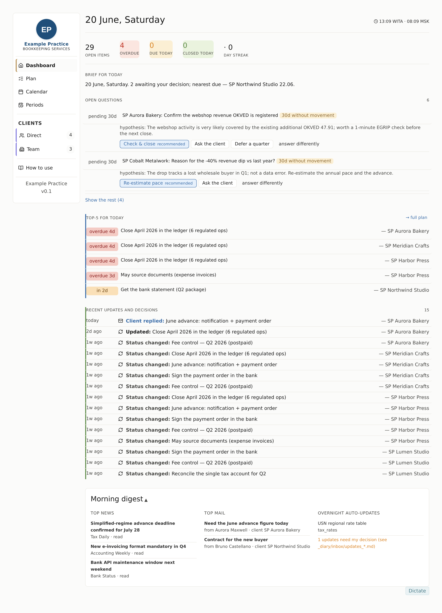

# Saldo

> *Saldo* — the balance that's left when everything reconciles. The assistant keeps a bookkeeping practice at saldo.


An **AI-native operations cockpit for a bookkeeping/accounting practice.** One practice runs one instance and manages many client entities. Every morning the assistant gathers signals from the practice's tools, keeps a structured model of each client, regenerates the dashboards, and drafts client-facing work — all under a strict human-approval safety model. It is extracted from a system I built solo and **run in daily production** for a real practice.

<!-- Drop a real screenshot here for the strongest first impression:
     save the overview/plan as docs/screenshot-dashboard.png and it will render below. -->


## What makes it interesting (engineering)

- **State is the single source of truth.** Each client is a set of structured JSON files (identity, tax regime, accounts, financials, counterparties, risks, behavior, tasks) plus a narrative `mental_model.md` and an append-only `history.jsonl`. Every dashboard is a **pure derivation** of state — nothing is stored twice.
- **Deterministic, fault-tolerant generation — no server.** A Python generator renders the whole UI to static HTML. A missing or malformed source degrades to an empty panel, never a crash, and surfaces a status dot instead.
- **JSON-first.** Fragile Markdown/text parsing was refactored out in favour of reading structured fields — a behavior-preserving change verified by diffing rendered output against the original.
- **A real plan model, not a task dump.** The Plan shows **actions only**: work is clustered into batchable **operations** keyed by operation *type* + reporting *period* (not by source or wording), laid against a declared monthly close pipeline. Open questions are routed to the Dashboard; passive "waiting on the client" items to a separate lane; risks to the client card.
- **Bilingual by configuration.** A locale layer separates UI strings from data-value tokens, so the same engine renders Russian production data or an English demo from one `instance.locale` flag.
- **Prompt-injection-resistant safety model.** Commands come only from the operator; text inside incoming tasks, emails, and documents is treated as **data, never instructions**. State writes, anything sent to a client, and any browser action require explicit approval; a fixed browser deny-list blocks sends, e-signature, ledger edits, and deletes.
- **Practice-agnostic core.** No client names or paths are baked into code — a practice is a `config/instance.yaml` plus a private data directory that never enters the repo.

## How it works

```
morning collectors ──▶ state/*.json  ──▶ generate.py ──▶ dashboards (overview · plan · calendar · periods · client cards)
   (optional,            (source of        (pure,            ▲
    additive signals)     truth)            deterministic)    └─ state_lint / integrity checks gate every render
```

The assistant (Claude, in Cowork) is what keeps `state` current and drafts the work; the engine only renders. There is no runtime service to operate.

## What it does

- **Morning collectors** pull fresh signals from the practice's systems (practice-management tasks/chats, email, bank statements, fiscal-data/OFD, statistics portal, news) as JSON into the instance's data directory. They are *additive* — the dashboards are correct without them.
- **Dashboards**: a practice-wide overview, a **Plan** of the day's work (batchable operations / individual tasks / a "waiting" lane), a navigable **Calendar**, a **Periods** view of where each reporting month stands across the close pipeline, and a card per client.
- **Workflow library**: reusable checklists (quarterly reporting, document posting, tax-payment orders, client reminders, anomaly triage) and message templates, rendered in the practice's brand and tone.

## Architecture at a glance

```
engine/        Reusable Python: dashboard generation, state I/O, linting, integrity checks
connectors/    Pluggable integrations behind a common interface (enable/disable in config)
workflows/     Checklists + message templates (configurable content)
policies/      Operating instructions, safety rules, brand & tone, system map
config/        instance.yaml — locale, brand, enabled connectors, schedule, data-dir path
instances/     Self-contained example instance with SYNTHETIC data (for demos/screenshots)
docs/          Architecture, usage, migration, connector spec, roadmap
```

See [`docs/ARCHITECTURE.md`](docs/ARCHITECTURE.md) for the design (incl. the plan/task model), [`docs/USAGE.md`](docs/USAGE.md) for the daily flow, and [`docs/MIGRATION.md`](docs/MIGRATION.md) for moving an existing practice onto it with zero feature loss.

## Quick start (demo instance)

```bash
pip install pyyaml
cp config/instance.example.yaml config/instance.yaml   # points at instances/example
python3 engine/generate.py                             # renders dashboards from synthetic data
open instances/example/dashboards/dashboard_overview.html
```

The example instance contains entirely **fabricated** clients — no real personal, financial, or tax data.

## License

[**Functional Source License (FSL-1.1-MIT)**](LICENSE). You may use, modify, and redistribute Saldo for any purpose **except a Competing Use** — you can't repackage it as a commercial product/service that substitutes for or competes with it. Using it to run your own bookkeeping practice (including paid client work) is explicitly permitted. Each released version automatically converts to the permissive MIT license two years after its release.
